# Semantic Analysis (Current Pipeline)

This document explains how semantic analysis is currently done in this repo.

## What is actually used

The current pipeline uses:

1. **TF-IDF + KMeans** to group related discussions into themes  
2. **Rule-based/NLP signals** for sentiment and structured extraction

It does **not** currently use embedding-based semantic search in production flow.

## Where it happens

- Main implementation: `eric_folder/reddit_scrapping/reddit_scrapping/analyze.py`
- Parallel copy: `jacob_folder/reddit_scrapping/reddit_scrapping/analyze.py`
- Pipeline entry: `eric_folder/reddit_scrapping/reddit_scrapping/pipeline.py`

## Data flow (high level)

1. Collect Reddit posts + comments  
2. Build text documents from each post  
3. Run per-text analysis (`analyze_text`) for sentiment + extracted signals  
4. Run `build_themes(...)` for TF-IDF + KMeans clustering  
5. Return structured outputs (`themes`, `quotes`, `summary`, CSV rows)

## Theme clustering details

Inside `build_themes(...)`:

- Uses `TfidfVectorizer(stop_words="english", max_features=1000, ngram_range=(1, 2))`
- Uses `KMeans(n_clusters=cluster_count, random_state=42, n_init=10)`
- For each cluster:
  - finds member posts
  - extracts top weighted centroid terms
  - emits a theme object with `theme_id`, `top_terms`, `post_ids`, `size`

## Signals extracted in `analyze_text(...)`

- Sentiment (VADER compound + label)
- Age mention
- Severity score + label
- Emotional score
- Lifestyle impacts
- Medical flags
- Quote category + quote score

## Grouped bar graph (analysis composition)

The graph below summarizes the current composition of the semantic-analysis approach.

```mermaid
xychart-beta
    title "Semantic Analysis - Grouped View"
    x-axis ["Posts", "Comments", "Combined"]
    y-axis "Relative Signal Weight" 0 --> 100
    bar "Theme Clustering (TF-IDF+KMeans)" [45, 30, 40]
    bar "Sentiment (VADER)" [20, 30, 25]
    bar "Rule-based Extraction" [35, 40, 35]
```



> Notes:
> - This is a conceptual composition graph for documentation.
> - It is not a benchmark chart.

## Flowchart (semantic analysis pipeline)

```mermaid
flowchart TD
    A[Collect Reddit posts + comments] --> B[Build post text documents]
    B --> C[Per-text analysis: analyze_text]
    C --> C1[Sentiment (VADER)]
    C --> C2[Rule-based extraction]
    C2 --> C21[Age / Severity / Emotional score]
    C2 --> C22[Lifestyle impacts / Medical flags]
    C --> D[Theme building: build_themes]
    D --> D1[TF-IDF vectorization]
    D1 --> D2[KMeans clustering]
    D2 --> D3[Top centroid terms per cluster]
    D3 --> E[Theme objects]
    C --> F[Quote scoring + selection]
    E --> G[Summary + JSON/CSV outputs]
    F --> G
```

