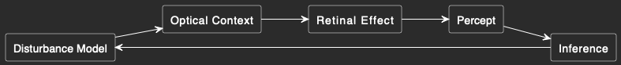

## Eye Disturbance Simulator (MVP)
## Concept
We simulate both the physical disturbance and what the user sees.
A disturbance inside the eye interacts with light to produce a retinal effect, which becomes the percept.
Core relationship:
Disturbance properties (especially depth) → Retinal shadow → Perceived artifact
This enables:
forward simulation (physics → perception)
backward inference (perception → physics)

## 1. Disturbance Model (Physical State)
**MVP Variables**
- shapeType — basic object form
- size — physical scale
- opacity — light blocking strength
- xPosition — horizontal location
- yPosition — vertical location
- depthZ — distance from retina
**To Add**
- thickness — strand width variation
- elongation — stretched vs round
- edgeIrregularity — smooth vs jagged
- fragmentCount — single vs cluster
- internalTexture — uniform vs fibrous
- densityProfile — center vs edge

## 2. Optical Context (Eye + Environment)
**MVP Variables**
- ambientBrightness — overall light level
- backgroundType — sky wall text
- pupilSize — aperture size
- focusState — near vs far
**To Add**
- lightDirection — incoming angle
- contrastLevel — scene contrast
- accommodation — lens adjustment
- fieldOfView — visible range
- vitreousRange — depth bounds

## 3. Retinal Effect (Optical Projection)
**MVP Variables**
- apparentSize — shadow size
- apparentBlur — edge softness
- apparentDarkness — shadow intensity
**To Add**
- edgeSoftness — gradient falloff
- transparency — partial light passage
- distortion — warped projection
- diffractionEffect — light bending
- contrastDrop — clarity reduction

## 4. Percept & Interaction (User + Inference)
**MVP Variables**
- perceivedShape — user seen form
- perceivedMotion — drift behavior
- similarityScore — match quality
- estimatedDepth — inferred distance
**To Add**
- motionTrail — trailing effect
- salience — attention strength
- backgroundSensitivity — visibility change
- userDrawing — manual input sketch
- parameterFit — optimization error

## Summary
**System loop:**
- Disturbance Model → Optical Context → Retinal Effect → Percept → Inference → Disturbance Model
**We simulate:**
- the cause (disturbance)
- the effect (what is seen)
- And connect them through a consistent mapping.

Some future directions:
1. We will require around the eye structure. 
2. We will also simulate far from eye structures that may play a role.