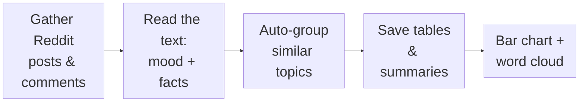
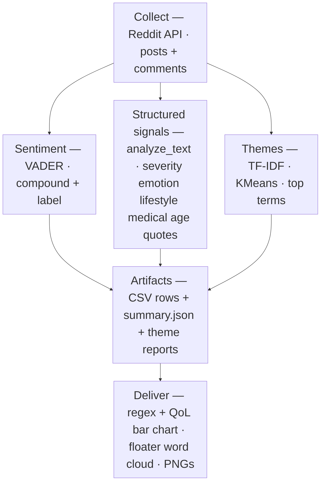

# Semantic analysis process (short)

End-to-end view: from Reddit collection to structured signals, themes, and the visualization layer in this folder.

## Very simple view (five steps, left → right)

Plain-language version of what the analysis does. **Large type** in the diagram below (works best in viewers that honor Mermaid `themeVariables`, e.g. GitHub, many IDEs).

- **Gather** — download threads and replies about floaters (and related queries).
- **Read the text** — run sentiment (VADER) and rule-based tags (severity, lifestyle, quotes, etc.).
- **Auto-group** — TF-IDF + KMeans finds clusters of “what people talk about together.”
- **Save** — write CSV rows and JSON so nothing is trapped in memory.
- **Show** — scripts in this folder turn the saved data into pictures you can share.

## Combined pipeline

Single top-down flow: one **collect** node; up to **three** parallel branches for grouped semantic analysis; then merged **artifacts**; then merged **deliverables** (regex/QoL bars + word cloud).

Implementation: `analyze_text` covers **sentiment** and **structured signals**; `build_themes` covers **TF-IDF / KMeans themes**. **Deliver** step uses `grouped_trends_graph.py` and `floater_word_cloud.py` in this folder.

## Files

| File | Role |
|------|------|
| `grouped_trends_graph.py` | Regex buckets + QoL counts → dual-panel bar chart |
| `floater_word_cloud.py` | Floater-topic text → B&W word cloud PNG |
| `SEMANTIC_ANALYSIS_PROCESS.md` | This diagram |

Core NLP/theming implementation (TF-IDF, KMeans, `analyze_text`) lives under `jacob_folder/reddit_scrapping/reddit_scrapping/` — see repo root `SEMANTIC_ANALYSIS.md` for detail.
